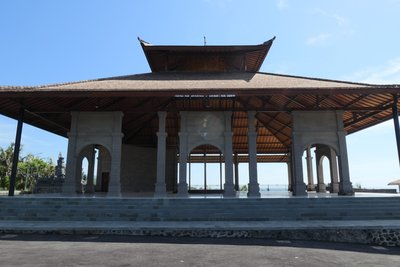
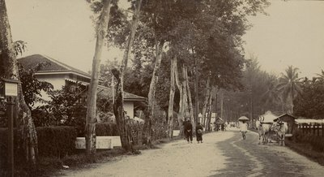
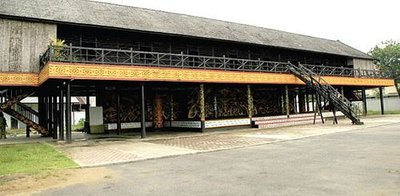
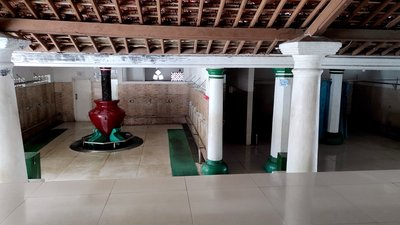

# 🏠 Image-Based Classification of Indonesian Traditional Houses

[](https://python.org)
[](https://docs.fast.ai)
[](https://pytorch.org)
[](LICENSE)
[](#contributing)

A deep learning image classification model that identifies **5 types of Indonesian traditional houses** using transfer learning with **ResNet-50** and the **FastAI** framework. This project preserves Indonesian cultural heritage through AI-powered visual recognition.

<div align="center">

| Balinese | Batak | Dayak | Javanese | Minangkabau |
|:--------:|:-----:|:-----:|:--------:|:-----------:|
|  |  |  |  |  |

</div>

---

## 📑 Table of Contents

- [Overview](#-overview)
- [Key Features](#-key-features)
- [Dataset](#-dataset)
- [Model Architecture](#-model-architecture)
- [Quick Start](#-quick-start)
- [Project Structure](#-project-structure)
- [Results](#-results)
- [Output Files](#-output-files)
- [Tech Stack](#-tech-stack)
- [Contributing](#-contributing)
- [Citation](#-citation)
- [License](#-license)
- [Acknowledgements](#-acknowledgements)

---

## 📋 Overview

Indonesia has a rich architectural heritage with hundreds of unique traditional house styles across its diverse ethnic groups. This project leverages modern deep learning techniques to automatically classify traditional house images into five major categories:

| # | Class | Description | Train Samples |
|:-:|-------|-------------|:-------------:|
| 1 | **Balinese** | Traditional Balinese compound architecture | 776 |
| 2 | **Batak** | Rumah Bolon from North Sumatra | 95 |
| 3 | **Dayak** | Rumah Betang (longhouse) from Kalimantan | 69 |
| 4 | **Javanese** | Joglo and traditional Javanese styles | 249 |
| 5 | **Minangkabau** | Rumah Gadang from West Sumatra | 563 |

> **Total:** 1,752 training images + 444 test images

---

## ✨ Key Features

- 🔄 **Transfer Learning** — Pretrained ResNet-50 backbone fine-tuned for domain-specific classification
- 📊 **Two-Stage Training** — Frozen backbone → full fine-tuning with discriminative learning rates
- 📈 **Rich EDA** — Class distribution analysis, sample visualization, and imbalance detection
- 🎯 **Model Evaluation** — Confusion matrix, top losses analysis, and per-class performance
- 💾 **Export Ready** — Complete model export for production inference (`export.pkl`)

---

## 📦 Dataset

> [!WARNING]
> The dataset is approximately **~4 GB** and is **not included** in this repository.
> GitHub has a 100 MB file size limit and recommends repositories stay under 1 GB.
> The dataset must be downloaded separately.

### Option 1: Kaggle CLI

```bash
# Install Kaggle CLI if not already installed
pip install kaggle

# Download and extract
kaggle datasets download -d <dataset-slug>
unzip <dataset>.zip -d "Indonesian Traditional Houses Dataset"
```

### Option 2: Manual Download

1. Download the dataset from the original source
2. Extract into the project root following the [directory structure](#-project-structure) below

---

## 🧠 Model Architecture

```
┌─────────────────────────────────────────────────┐
│              ResNet-50 (ImageNet)                │
│         Pretrained Feature Extractor            │
└───────────────────┬─────────────────────────────┘
                    │
┌───────────────────▼─────────────────────────────┐
│           Custom Classification Head             │
│     AdaptiveAvgPool → Flatten → BatchNorm →     │
│     Dropout → Linear → ReLU → BatchNorm →       │
│     Dropout → Linear(5)                          │
└─────────────────────────────────────────────────┘
```

### Training Strategy

| Stage | Description | Epochs | Learning Rate |
|:-----:|-------------|:------:|:-------------:|
| 1 | Train head layers (backbone frozen) | 20 | `1e-4` → `1e-3` |
| 2 | Fine-tune entire network (unfrozen) | 10 | `1e-5` → `1e-4` |

- **Input Resolution:** 320 × 320 pixels
- **Augmentation:** FastAI standard transforms (flip, rotate, zoom, warp, lighting)
- **Validation Split:** 20% with fixed seed (`42`) for reproducibility

---

## 🚀 Quick Start

### Prerequisites

- Python 3.10 or higher
- NVIDIA GPU with CUDA support (recommended for training)
- ~4 GB disk space for the dataset

### Installation

```bash
# 1. Clone the repository
git clone https://github.com/<username>/Image-Based-Classification-of-Indonesian-Traditional-Houses.git
cd Image-Based-Classification-of-Indonesian-Traditional-Houses

# 2. Create and activate a virtual environment
python -m venv venv
source venv/bin/activate      # Linux / macOS
# venv\Scripts\activate       # Windows

# 3. Install dependencies
pip install -r requirements.txt

# 4. Download & place the dataset (see Dataset section above)

# 5. Launch the notebook
jupyter notebook traditional-house-classification-use-fastai.ipynb
```

---

## 🗂 Project Structure

```
Image-Based Classification of Indonesian Traditional Houses/
│
├── 📓 traditional-house-classification-use-fastai.ipynb  ← Main notebook
├── 📄 README.md
├── 📄 requirements.txt
├── 📄 LICENSE
├── 📄 CONTRIBUTING.md
├── 📄 CODE_OF_CONDUCT.md
├── 📄 CITATION.cff
├── 📄 .gitignore
│
├── 📁 .github/
│   ├── 📁 ISSUE_TEMPLATE/
│   │   ├── bug_report.md
│   │   └── feature_request.md
│   ├── PULL_REQUEST_TEMPLATE.md
│   └── 📁 workflows/
│       └── ci.yml
│
├── 📁 docs/
│   └── 📁 images/                      ← Sample images for README
│
├── 📁 models/                          ← Generated after training
│   ├── export.pkl
│   └── stage-final.pth
│
├── 📄 predictions.csv                  ← Generated after inference
│
└── 📁 Indonesian Traditional Houses Dataset/   ⚠️  NOT in repository
    ├── 📁 Train/
    │   └── 📁 Train/
    │       ├── 📁 balinese/       (776 images)
    │       ├── 📁 batak/          (95 images)
    │       ├── 📁 dayak/          (69 images)
    │       ├── 📁 javanese/       (249 images)
    │       └── 📁 minangkabau/    (563 images)
    └── 📁 Test/
        └── 📁 Test/               (444 images)
```

---

## 📊 Results

> [!NOTE]
> Detailed training results including confusion matrix, loss curves, and top losses analysis are available inside the notebook after execution.

| Metric | Value |
|--------|-------|
| Architecture | ResNet-50 (ImageNet pretrained) |
| Total Epochs | 30 (20 + 10) |
| Validation Split | 20% |
| Training Strategy | Two-stage transfer learning |
| Reproducibility Seed | 42 |

---

## 📁 Output Files

| File | Description |
|------|-------------|
| `predictions.csv` | Predicted labels for 444 test images with confidence scores |
| `models/export.pkl` | Complete model export (architecture + weights + vocabulary) |
| `models/stage-final.pth` | Final training checkpoint for resuming training |

---

## 🛠 Tech Stack

| Component | Technology | Version |
|-----------|------------|---------|
| Language | Python | 3.10+ |
| Deep Learning | PyTorch | 2.x |
| High-level API | FastAI | 2.x |
| Model | ResNet-50 | ImageNet pretrained |
| Visualization | Matplotlib, Seaborn | — |
| Data Processing | Pandas, NumPy | — |
| Image Processing | OpenCV | — |
| ML Utilities | scikit-learn | — |

---

## 🤝 Contributing

Contributions are welcome! Please read the [Contributing Guidelines](CONTRIBUTING.md) and [Code of Conduct](CODE_OF_CONDUCT.md) before getting started.

1. Fork the repository
2. Create your feature branch (`git checkout -b feature/amazing-feature`)
3. Commit your changes (`git commit -m 'Add amazing feature'`)
4. Push to the branch (`git push origin feature/amazing-feature`)
5. Open a Pull Request

---

## 📖 Citation

If you use this project in your research, please cite it:

```bibtex
@software{aditama2025indonesian,
  author    = {Aditama},
  title     = {Image-Based Classification of Indonesian Traditional Houses},
  year      = {2025},
  url       = {https://github.com/<username>/Image-Based-Classification-of-Indonesian-Traditional-Houses}
}
```

Or use the **"Cite this repository"** button on GitHub (powered by `CITATION.cff`).

---

## 📝 License

This project is licensed under the **MIT License** — see the [LICENSE](LICENSE) file for details.

---

## 🙏 Acknowledgements

- [FastAI](https://docs.fast.ai/) — High-level deep learning library built on PyTorch
- [PyTorch](https://pytorch.org/) — Open-source deep learning framework
- Dataset creators for providing the Indonesian Traditional Houses Dataset
- The diverse cultural heritage of Indonesia that inspired this project

---

<div align="center">

**⭐ If you find this project useful, please consider giving it a star! ⭐**

Made with ❤️ for Indonesian Cultural Heritage Preservation

</div>
